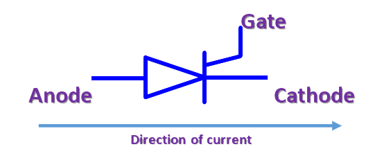
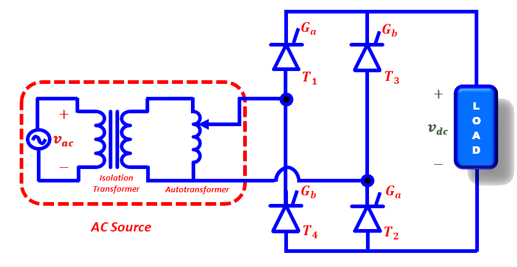
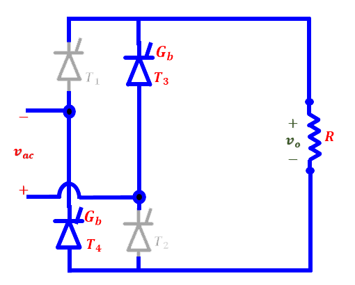

### Theory

  
  
Fig. 1. Silicon controlled rectifier/ Thyristor.

 
A thyristor [1]-[2] is a semiconductor device comprising four layers that form a P-N-P-N structure. It has three terminals: anode (A), cathode (K), and gate (G). The gate terminal is responsible for triggering the thyristor. Applying a small current to the gate can turn-ON the device, and once it is ON-state, the gate loses control, causing the thyristor to remain conducting until the current falls below the holding current level. The thyristor operation is classified into four modes: Forward Blocking, Forward Conduction, Reverse Blocking, and Reverse Breakdown.  
Thyristor-based rectifiers, which convert AC –to- DC, are extensively used in various industrial applications due to their efficiency, controllability, and reliability. These rectifiers offer controlled rectification, allowing to realize different output voltage and current levels. By adjusting the firing angle, the average load voltage of the rectifier can be varied, enabling smooth control of the power delivered to the load. 

 

  
  
 Fig. 2. Circuit diagram of controlled rectifier.

 

<table border="0" align="center" style="width:100%; border:none;">
  <tr>
<td style="width:50%">

  
Fig. 3(a). Positive-half cycle.
  

</td>
<td style="width:50%">
  

  
Fig. 3(b). Negative-half cycle.
  

 
    </td>
  </tr>
</table>
 

 
Fig. 2 shows a fully controlled bridge rectifier, which uses four thyristors to control the load voltage. Thyristors T1 and T2 must be fired simultaneously during the positive half cycle while Thyristors T3 and T4 must be fired during the negative half cycle of the source voltage. All the thyristors must be given firing pulses of suitable pulse sequence. The steady-state waveforms for two different loads (R and R-L) are shown in Fig. 4. Based on these waveforms various equations (for RL-load) are formulated [3]-[5] as given below:
  
The average output voltage and currents are defined by:
 

 

  

    ..(1)

 

&nbsp;

  
      

    ..(2)

 
